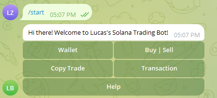
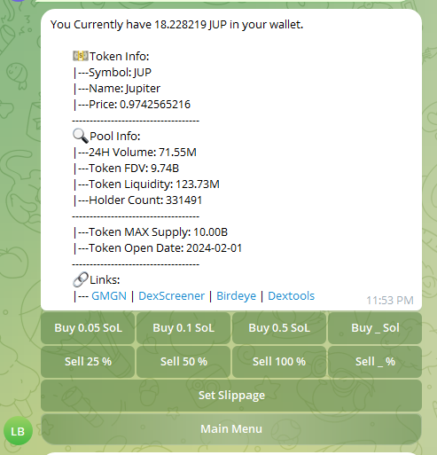

# 📢 CryptoTrade Telegram Bot

<p align="center">
  
  
  <br>
  
  
  <br>
  
  
</p>

---

## 📖 Description
Welcome to the **CryptoTrade Telegram Bot**! 🚀

This bot allows users to trade cryptocurrencies directly within Telegram chats. It processes user commands for buying, selling, and checking balances, making it easy to interact with the crypto market.

> **This bot is designed for educational purposes** to help users understand blockchain technology and cryptocurrency trading. Future updates will include **copy trading** and **wallet transaction monitoring**, merging learning with potential earnings. 💡

---

## ⚠️ Disclaimer
This bot is **experimental** and should be used **at your own risk**. I am not responsible for any loss of funds, damages, or other liabilities arising from its use. **This is not financial advice.** Always do your own research before trading.

---

## 🛠️ Installation

### 1️⃣ Node Endpoint Setup
- Visit [QuickNode](https://www.quicknode.com/) to obtain your node endpoints.
- Place your endpoints in the `config.py` file.

### 2️⃣ Telegram Bot Token
- Create a Telegram bot using [BotFather](https://t.me/BotFather) and obtain your bot token.
- Insert your bot token into the `config.py` file.

### 3️⃣ Install Dependencies
```sh
pip install -r requirements.txt
```

---

## 🔬 Usage
Run the bot using:
```sh
python main.py
```

---

## ✨ Features
✅ **Buy Token**: Effortlessly purchase cryptocurrencies.  
✅ **Sell Token**: Quickly sell your cryptocurrencies.  
✅ **Check Balance**: Instantly view your current balance.  
✅ **Check Token Info**: Get detailed information about specific tokens.  

---

## 📝 TO-DO
- [ ] Add **Copy Trading** Feature 📈
- [ ] Implement **Wallet Transaction Monitoring** 🔍
- [ ] Enhance **Transaction Speed and Success Rate** ⚡

---

## 📸 Screenshots
<p align="center">
  
  
</p>

---

## 🤝 Contributing
We welcome contributions! 🚀

Here are some ways to contribute:
- **Copy Trading**: Implement a feature that allows users to copy trades from experienced traders.
- **Transaction Monitoring**: Develop a system to notify users of wallet activities.
- **Transaction Optimization**: Improve the bot's efficiency and execution speed.

To contribute, **submit a pull request** to our [GitHub repository](https://github.com/yourusername/CryptoTrade-Telegram-Bot).

---

## ✨ Credits
This project utilizes:
- [Jupiter Python CLI](https://github.com/jup-ag/jupiter-python-cli)
- [Jupiter Python SDK](https://github.com/jup-ag/jupiter-python-sdk)

---

## 🧾 License
This project is licensed under the **MIT License**. See the [LICENSE](LICENSE) file for more details.

---

💙 **Enjoy trading! If you find this project useful, don't forget to ⭐ star the repo!** 🚀